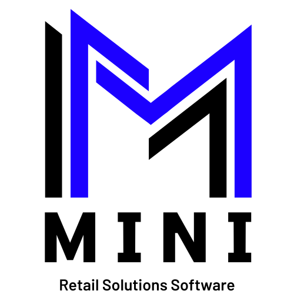

  

# Mini

**Mini** is a Node.js and Express.js application providing a comprehensive suite of RESTful APIs designed to manage small and medium-sized retail stores. The app follows the MVC (Model-View-Controller) architecture and uses MongoDB for data storage. Authentication and authorization are handled using JWT, sessions, and cookies.

## Features

- **User Management**: Registration, authentication, profile management, and role-based access control.
- **Admin Operations**: User role assignments, system monitoring, and reporting.
- **Inventory Management**: Product management, categories, stock levels, and tracking.
- **Supplier Management**: Supplier details, orders, and delivery tracking.
- **Client Management**: Client information, purchase history, and loyalty programs.
- **Order Processing**: Creation, updating, and tracking of orders.
- **Invoicing**: Generate and manage invoices.
- **Payments**: Process and track payments.
- **Sales and Analytics**: Generate sales reports and analyze retail performance.

## Technologies Used

- **Backend**: Node.js with Express.js framework
- **Database**: MongoDB
- **Authentication**: JWT (JSON Web Tokens) with sessions and cookies
- **API Documentation**: Swagger/OpenAPI
- **Version Control**: Git

## Architecture

The application is structured following the MVC pattern:

1. **Model**: Defines the data structure using MongoDB schemas.
2. **View**: Not applicable for a purely API-based service (frontend to be developed in the future).
3. **Controller**: Handles the application logic, processes HTTP requests, and interacts with the models.

## Security

- **Authentication**: Implemented using JWT to ensure secure access to the APIs.
- **Authorization**: Role-based access control to restrict access to sensitive endpoints based on user roles (e.g., admin, user).

## Copyright

- Copyright (c) 2024 [mini-retail-system](https://github.com/kareemaboueid/mini-retail-system) [Kareem Aboueid](https://github.com/kareemaboueid)
- [MIT License](https://github.com/kareemaboueid/mini-retail-system/blob/master/LICENSE)
